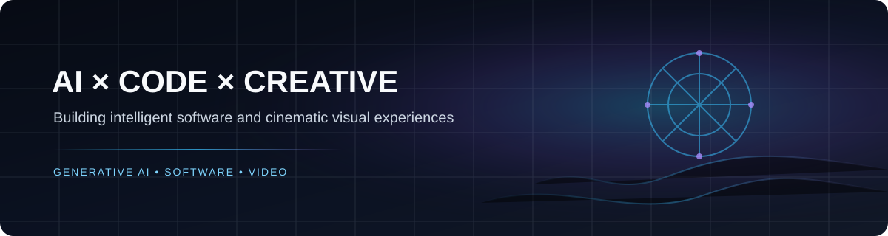

<div align="center">



# Sai Krishna Bethamcharla

### AI & Software Developer · AI Video Creator · Professional Video Editor

**Building intelligent software and cinematic visual experiences with AI.**

<a href="https://www.instagram.com/saikrishna_bethamcharla?igsi=MWU3a2RtdGVwOGhveA%3D%3D&utm_source=qr">Instagram</a> · <a href="https://github.com/saikrishna-bethamcharla">GitHub</a>

</div>

---

## About Me

I'm a developer and creative technologist working at **ZAI Labs**, combining **software engineering, Generative AI and visual production** to turn ideas into working digital products and polished visual content.

My current work sits across two worlds:

- **Build:** AI-powered software, websites, web applications, APIs and digital products.
- **Create:** AI-generated video, cinematic visual development, professional editing, motion graphics and post-production.

I enjoy the space where **technology becomes a creative tool**.

## What I Do

<table>
<tr>
<td width="50%" valign="top">

### 🤖 AI & Generative AI

- Generative AI applications and integrations
- AI-assisted software development
- AI image and video generation
- Prompt engineering
- AI automation workflows
- Creative AI pipelines

</td>
<td width="50%" valign="top">

### 💻 Software & Web

- Python
- JavaScript / Node.js
- React
- Flask
- REST APIs
- Full-stack web applications
- Digital products and software tools

</td>
</tr>
<tr>
<td width="50%" valign="top">

### 🎬 AI Video & Film

- AI video creation
- Cinematic shot development
- AI-assisted filmmaking
- Character and visual consistency
- Commercial & promotional content
- Visual storytelling

</td>
<td width="50%" valign="top">

### ✂️ Post-Production

- Professional video editing
- Motion graphics
- Visual effects workflows
- Sound and pacing
- Color and visual continuity
- Final delivery for digital platforms

</td>
</tr>
</table>

## 🧠 Tech & Creative Stack

**Development**  
`Python` `JavaScript` `Node.js` `React` `Flask` `HTML` `CSS` `REST APIs`

**AI**  
`Generative AI` `AI Video` `AI Image Generation` `Prompt Engineering` `AI Automation`

**Creative**  
`Video Editing` `Motion Graphics` `Post-Production` `Cinematic Storytelling` `Visual Development`

## 📊 GitHub Activity

<div align="center">

[](https://github.com/saikrishna-bethamcharla)

</div>

## Selected Work

### 🎥 AI Video & Visual Creation

Creating AI-driven cinematic content, commercials, character-based videos, promotional visuals and storytelling workflows. The process spans concept development, prompting, shot design, generation, continuity and professional post-production.

### 🧩 AI-Powered Software

Building practical applications and tools that combine software engineering with intelligent automation and Generative AI.

### 🌐 Web & Digital Products

Developing modern websites, web applications, backend services, APIs and digital experiences with a focus on usability and clean implementation.

## Current Focus

```text
AI DEVELOPMENT       ████████████████████  Generative AI · AI Applications
WEB & SOFTWARE       ██████████████████░░  Websites · Apps · APIs
AI VIDEO             ███████████████████░  Generation · Cinematic Workflows
POST-PRODUCTION      █████████████████░░░  Editing · Motion · Finishing
CREATIVE TECHNOLOGY  ████████████████████  AI × Visual Storytelling
```

## Philosophy

> **Build the technology. Create the experience.**

I'm interested in practical AI, thoughtful software and visual storytelling that feels intentional rather than automated for the sake of automation.

<div align="center">

### Let's build something interesting.

<a href="https://github.com/saikrishna-bethamcharla">Explore my work on GitHub →</a>

</div>
