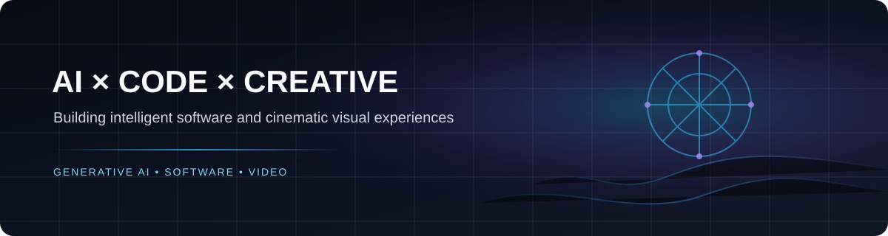

<div align="center">

<!-- Hero Banner -->


<!-- Dynamic Typing SVG Headline -->
<a href="https://github.com/saikrishna-bethamcharla">
  
</a>

<p align="center">
  <b>Creative Technologist @ ZAI Labs</b><br>
  Combining <b>Generative AI</b>, <b>Creative Video Production</b>, and <b>Software Scripting</b>
</p>

<!-- Social & Metric Badges -->
<p align="center">
  <a href="https://github.com/saikrishna-bethamcharla">
    
  </a>
  <a href="https://www.instagram.com/saikrishna_bethamcharla?igsi=MWU3a2RtdGVwOGhveA%3D%3D&utm_source=qr">
    
  </a>
  
</p>

</div>

---

## ⚡ About Me

I am a creative technologist and developer working at **ZAI Labs**, focused on **visual production, Generative AI workflows, and software solutions**.

- 🎬 **Create:** AI-generated cinematic video, prompt-engineered visual assets, storytelling pipelines, and professional post-production.
- 💻 **Build:** Python automation scripts, web interfaces, and creative digital workflows.
- 💡 **Philosophy:** *"Build the technology. Create the experience."* Technology is most powerful when it amplifies human imagination.

---

## 🛠️ Tech Stack & Creative Toolkit

<div align="center">
  
</div>

<br/>

### 🎬 Creative AI & Generative Media Tools


### ✂️ Post-Production, Video Editing & Creative Suite


### 💻 Core Programming & Web Languages


### ☁️ DevOps, Cloud & Developer Tools


---

## 🎯 What I Do

<table>
  <tr>
    <td width="50%" valign="top">
      <h3>🎬 AI Filmmaking & Media Direction</h3>
      <ul>
        <li><b>Cinematic Shot Generation:</b> Dynamic camera choreography, lighting, and composition using AI tools.</li>
        <li><b>Visual Continuity:</b> Multi-scene character, wardrobe, and aesthetic consistency.</li>
        <li><b>Commercial Content:</b> High-impact brand videos, motion ads, and promotional visuals.</li>
        <li><b>AI Hybrid Filmmaking:</b> Blending generative visuals with real-world cinematography techniques.</li>
      </ul>
    </td>
    <td width="50%" valign="top">
      <h3>✂️ Post-Production & Finishing</h3>
      <ul>
        <li><b>Professional Editing:</b> Narrative pacing, rhythm cutting, and sequence assembly in Premiere Pro.</li>
        <li><b>Motion Graphics & VFX:</b> Compositing, title design, and visual enhancements in After Effects.</li>
        <li><b>Color Grading:</b> Industry-standard color science and mood grading in DaVinci Resolve.</li>
        <li><b>Audio Mastering:</b> Sound design, pacing, and audio finishing in Audition.</li>
      </ul>
    </td>
  </tr>
  <tr>
    <td width="50%" valign="top">
      <h3>🤖 Generative AI Pipelines</h3>
      <ul>
        <li><b>Node Workflows:</b> Custom node pipelines with ComfyUI for image and video synthesis.</li>
        <li><b>Prompt Architecture:</b> Multi-modal prompt engineering for fine aesthetic control.</li>
        <li><b>Generative Video:</b> Next-generation AI video generation with Runway, Higgsfield AI, and Stable Diffusion.</li>
        <li><b>Workflow Automation:</b> Streamlining creative asset generation and conversion.</li>
      </ul>
    </td>
    <td width="50%" valign="top">
      <h3>💻 Scripting & Web Development</h3>
      <ul>
        <li><b>Python Scripting:</b> Automation scripts, batch media processors, and utility tools.</li>
        <li><b>Web Development:</b> Clean and responsive web frontends with HTML5, CSS3, and JavaScript.</li>
        <li><b>Version Control:</b> Structured Git workflows, branch management, and repository hygiene.</li>
        <li><b>Environment Setup:</b> Containerized local setups with Docker and Linux tools.</li>
      </ul>
    </td>
  </tr>
</table>

---

## 📊 GitHub Analytics & Activity

<div align="center">
  
  
</div>

<br/>

<div align="center">
  <h3>🐍 Contribution Graph in Motion</h3>
  <picture>
    <source media="(prefers-color-scheme: dark)" srcset="https://raw.githubusercontent.com/saikrishna-bethamcharla/saikrishna-bethamcharla/output/github-contribution-grid-snake-dark.svg">
    <source media="(prefers-color-scheme: light)" srcset="https://raw.githubusercontent.com/saikrishna-bethamcharla/saikrishna-bethamcharla/output/github-contribution-grid-snake.svg">
    
  </picture>
</div>

---

## 🔭 Current Focus

```text
CREATIVE AI          ████████████████████  ComfyUI · Higgsfield · Stable Diffusion
AI VIDEO CREATION    ███████████████████░  Cinematic Workflows · Shot Design
POST-PRODUCTION      ██████████████████░░  Premiere Pro · DaVinci · After Effects
SCRIPTING & WEB      ████████████████░░░░  Python · JavaScript · HTML5 · CSS3
CREATIVE TECH        ████████████████████  Where Technology Meets Imagination
```

---

<div align="center">

### 🤝 Let's Collaborate & Build Something Exceptional

Whether you have an ambitious AI video project, creative media direction needs, or digital workflows to build:

<a href="https://github.com/saikrishna-bethamcharla">
  
</a>
&nbsp;
<a href="https://www.instagram.com/saikrishna_bethamcharla?igsi=MWU3a2RtdGVwOGhveA%3D%3D&utm_source=qr">
  
</a>

<br><br>

<sub>Designed with precision & aesthetic harmony · © Sai Krishna Bethamcharla</sub>

</div>
